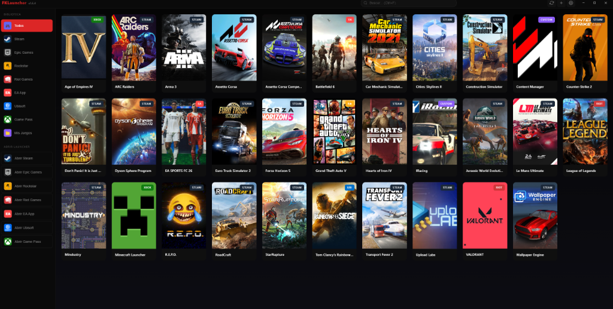
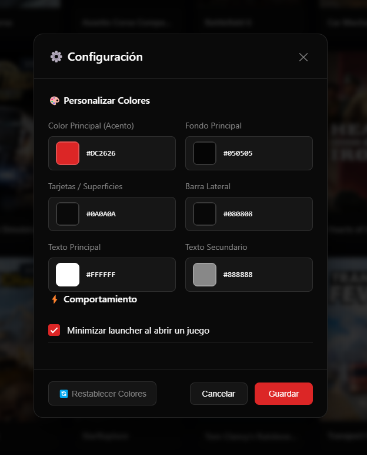
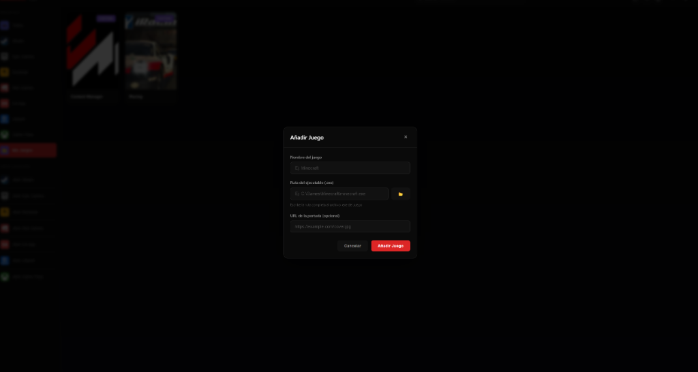

  <h3>🌍 English | <a href="#-fklauncher-español">🇪🇸 Español</a></h3>

 

  
    
  <h1>🚀 FKLauncher</h1>
  
<b>Unified, Customizable and Lightweight Game Launcher</b>

  
<i>Organize and launch all your games from a single, beautifully designed application.</i>

---

## 📖 Overview

**FKLauncher** is a custom desktop application designed to solve the problem of having multiple game clients (Steam, Epic Games, Riot, EA, Xbox, etc.) scattered across your system. It acts as a central hub, automatically detecting games from various platforms and allowing you to add your own custom executables seamlessly. 

Built with a focus on **speed, aesthetics, and user experience**, it features a sleek dark mode design, cover art fetching, and deep customization options.

> 💡 **Want to try it out?**  
> **[Download the latest version (FKLauncher-v1.7.1)](./FKLauncher.exe)** and organize your library instantly!

### Latest Version: v1.7.1 (Riot Games Fix & Global Config)
*   **Riot Games Fix:** Resolved issues where Riot games (Valorant, LoL) would fail to launch on certain systems.
*   **Global Integration:** Pre-configured global fallbacks for Discord Rich Presence and IGDB metadata.
*   **Next-Gen Scanning:** 90% faster scans using worker threads and incremental caching.
*   **Advanced UX:** New Mini Mode, Custom Tags, and granular Update Progress tracking.
*   **Military Grade Security:** 100% obfuscated source code and tamper-resistant binaries.

---

## ✨ Features

- 🎮 **Unified Game Library:** View all your installed games across launchers in one unified grid. 
- 🔗 **Platform Detection:** Native support and badging for `Steam`, `Epic Games`, `Xbox / Game Pass`, `Rockstar`, `Riot Games`, `EA App`, and `Ubisoft`.
- ➕ **Add Custom Games:** Easily add any standalone `.exe` or custom game to your library via the internal file and cover manager.
- 🎨 **Deep Customization:** Modify the primary accent color, background hex, sidebar color, text colors, and more through a built-in settings panel.
- 🖼️ **Dynamic Covers:** Full visual support for dynamic covers and custom URLs.
- ⚡ **Lightweight & Fast:** Designed to minimize resource usage. Configurable option to auto-minimize when a game is launched to free up resources.
- 🔍 **Real-Time Search:** Instantly find your games across your huge library with keyboard shortcuts (`Ctrl+F`).
- 🏃 **Quick Launcher Access:** Direct links in the sidebar to open the original clients natively.

---

## 📸 Screenshots

### Settings & Customization
Take control over the look and feel. Tweak the interface elements via precise Hex codes and configure launcher behavior like auto-minimize.

### Adding Custom Games
A simple and intuitive UI for adding standalone executables, complete with automatic path browsing and optional cover URL fetching.

---
---

 

  <h3><a href="#-fklauncher">🌍 English</a> | 🇪🇸 Español</h3>

 

  
    
  <h1>🚀 FKLauncher (Español)</h1>
  
<b>Lanzador de Juegos Unificado, Personalizable y Ligero</b>

  
<i>Organiza y lanza todos tus juegos desde una única aplicación con un hermoso diseño.</i>

---

## 📖 Descripción General

**FKLauncher** es una aplicación de escritorio personalizada diseñada para resolver el problema de tener múltiples clientes de juegos (Steam, Epic Games, Riot, EA, Xbox, etc.) dispersos por tu sistema. Actúa como un centro unificado, detectando automáticamente los juegos de varias plataformas y permitiéndote añadir tus propios ejecutables personalizados de forma fluida.

Construido con un enfoque en la **velocidad, la estética y la experiencia del usuario**, cuenta con un elegante diseño en modo oscuro, obtención de portadas y profundas opciones de personalización.

> 💡 **¿Quieres probarlo?**  
> **[Descarga la última versión (FKLauncher-v1.7.1)](./FKLauncher.exe)** ¡y organiza tu biblioteca al instante!

### Versión Actual: v1.7.1 (Riot Games Fix & Config Global)
*   **Riot Games Fix:** Solucionado el fallo que impedía lanzar juegos de Riot (Valorant, LoL) en algunos sistemas.
*   **Configuración Global:** Pre-configuración de Discord Rich Presence e IGDB de manera global para todos los usuarios.
*   **Escaneo Ultra-rápido:** Mejoras en el rendimiento del escaneo mediante hilos de trabajo y caché.
*   **UX Avanzada:** Nuevo Modo Mini, etiquetas personalizadas y progreso de descarga granular.
*   **Seguridad Grado Militar:** Código fuente 100% ofuscado y binario protegido contra ingeniería inversa.

---

## ✨ Características Principales

- 🎮 **Biblioteca de Juegos Unificada:** Visualiza todos tus juegos instalados en diferentes lanzadores en una única cuadrícula unificada.
- 🔗 **Detección de Plataformas:** Soporte nativo e insignias para `Steam`, `Epic Games`, `Xbox / Game Pass`, `Rockstar`, `Riot Games`, `EA App` y `Ubisoft`.
- ➕ **Añadir Juegos Personalizados:** Añade fácilmente cualquier `.exe` independiente o juego personalizado a tu biblioteca mediante el gestor interno de rutas y carátulas.
- 🎨 **Personalización Profunda:** Modifica el color de acento principal, el fondo hexadecimal, el color de la barra lateral, los colores del texto y más a través de un panel de configuración integrado.
- 🖼️ **Portadas Dinámicas:** Soporte visual completo para carátulas dinámicas y URLs personalizadas.
- ⚡ **Ligero y Rápido:** Diseñado para minimizar el uso de recursos. Opción configurable para minimizarse automáticamente al lanzar un juego, liberando recursos.
- 🔍 **Búsqueda en Tiempo Real:** Encuentra instantáneamente tus juegos en toda tu biblioteca con atajos de teclado (`Ctrl+F`).
- 🏃 **Acceso Rápido a Lanzadores:** Enlaces directos en la barra lateral para abrir los clientes originales de forma nativa.

---

## 📸 Capturas de Pantalla

### Configuración y Personalización
Toma el control del aspecto visual. Ajusta los elementos de la interfaz mediante códigos Hexadecimales precisos y configura el comportamiento del lanzador como el auto-minimizado.

### Añadir Juegos Personalizados
Una interfaz de usuario sencilla e intuitiva para añadir ejecutables de forma independiente, que incluye búsqueda automática de rutas y descarga opcional de la URL de la portada.

---

  <i>Developed to keep gaming simple, clean, and unified.</i>
    
  
© 2026 Ismael Pérez (FKShield). All Rights Reserved.

